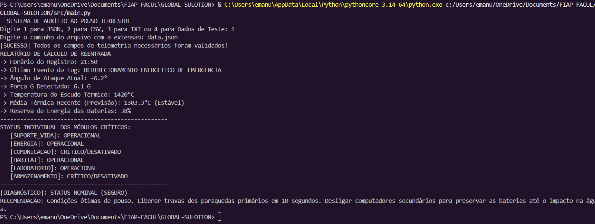

# 🚀 Sistema de Auxílio ao Pouso Terrestre (Missão Lua)

## 📋 Integrantes

**Equipe:** *Nome da Equipe*

| Nome         | RM      |
| ------------ | ------- |
| Emanuel B.B Domingues | 569732 |
| João Pedro Hornos | 572004 |


---

# 🎯 Objetivo do Projeto

Este projeto simula um sistema inteligente de monitoramento para uma missão espacial em fase de reentrada terrestre após uma missão lunar.

O sistema recebe dados de telemetria, realiza análises operacionais, identifica situações de risco, gera alertas automáticos e apresenta recomendações para auxiliar na tomada de decisão durante o pouso.

Além disso, é realizada uma análise simples de tendência térmica para prever possíveis comportamentos da cápsula durante a reentrada.

---

# 🛰️ Dados Monitorados

O sistema analisa os seguintes parâmetros:

| Variável           | Descrição                                |
| ------------------ | ---------------------------------------- |
| angulo_reentrada   | Ângulo atual de entrada na atmosfera     |
| energia_bateria    | Nível de energia disponível              |
| forca_g            | Força gravitacional sofrida pela cápsula |
| temperatura_escudo | Temperatura do escudo térmico            |
| modulos_binarios   | Estado dos módulos críticos              |
| log_evento         | Último evento registrado                 |

---

# 🏗️ Estruturas de Dados Utilizadas

## 📌 Lista

Utilizada para armazenar alertas e eventos críticos.

```python
fila_alertas = []
pilha_critica = []
```

---

## 📌 Matriz (Lista de Listas)

Armazena todas as leituras de telemetria recebidas.

```python
matriz_leituras = []
```

Cada linha da matriz contém:

* Horário
* Ângulo de reentrada
* Energia da bateria
* Força G
* Temperatura do escudo
* Estado dos módulos
* Evento registrado

---

## 📌 Dicionário

Utilizado para representar o estado dos módulos críticos da nave.

```python
dicionario_modulos = {}
```

### Módulos monitorados

* Suporte à Vida
* Energia
* Comunicação
* Habitat
* Laboratório
* Armazenamento

---

## 📌 Fila

Responsável por organizar os alertas gerados pelo sistema.

```python
fila_alertas.append(alerta)
```

---

## 📌 Pilha

Responsável por armazenar os eventos críticos mais recentes.

```python
pilha_critica.append(evento)
```

---

# 🧠 Regras Lógicas de Diagnóstico

O sistema utiliza estruturas condicionais (`if`, `elif` e `else`) juntamente com operadores lógicos (`AND`, `OR` e `NOT`) para classificar o estado da missão.

## Expressão Booleana Principal

```python
(angulo > -5.5 or angulo < -7.5) or
(temperatura > 1500) or
(forca_g > 6.5 and bateria < 25)
```

---

## 🚨 Alerta Crítico de Trajetória

Condição:

```python
angulo > -5.5 or angulo < -7.5
```

### Ação

* Corrigir o ângulo utilizando os propulsores de manobra.
* Evitar ricochete atmosférico ou destruição por reentrada excessivamente inclinada.

---

## 🔥 Alerta Crítico de Integridade

Condição:

```python
temperatura > 1500
```

ou

```python
forca_g > 6.5 and bateria < 25
```

### Ação

* Direcionar energia para sistemas essenciais.
* Desativar sistemas secundários.

---

## ⚠️ Inconsistência Proposital

Condição:

```python
bateria < 20 and modulos_binarios == 63
```

### Interpretação

A bateria está em estado crítico enquanto todos os módulos aparecem ativos.

Essa situação foi criada propositalmente para validar a capacidade de diagnóstico do sistema.

---

# 📈 Técnica de Previsão

Foi utilizada uma análise baseada na média das três últimas leituras de temperatura.

```python
media_temperatura_recente =
planilha['temperatura_escudo'].tail(3).mean()
```

Essa previsão permite identificar tendências térmicas e auxiliar na tomada de decisão durante a reentrada.

---

# ▶️ Como Executar

## Instalação das Dependências

```bash
pip install -r requirements.txt
```

## Execução

```bash
python main.py
```

---

## Opções de Entrada

| Opção | Tipo           |
| ----- | -------------- |
| 1     | JSON           |
| 2     | CSV            |
| 3     | TXT            |
| 4     | Dados de Teste |

---

# 📥 Exemplo de Entrada

O sistema espera os seguintes campos:

```text
angulo_reentrada
energia_bateria
forca_g
temperatura_escudo
modulos_binarios
log_evento
```

---

# 📤 Exemplo de Saída



---

# 🛠️ Recomendações Geradas

Dependendo do cenário detectado, o sistema pode recomendar:

### Status Nominal

* Preparar sequência de pouso.
* Preservar energia até o impacto.

### Alerta de Trajetória

* Corrigir o ângulo de reentrada.

### Alerta de Integridade

* Priorizar sistemas essenciais.

### Inconsistência Detectada

* Revisar imediatamente os dados da telemetria.

---

# 📂 Estrutura do Projeto

```text
.
├── main.py
├── requirements.txt
├── data.json
├── README.md
├── docs
│   ├── relatorio.pdf
│   ├── link_video.txt
│   └── uso_ia.md
```

---

# 🎥 Vídeo de Apresentação

Link do vídeo:

```text
https://youtu.be/rMs_zJqqdw8
```

---

# 📚 Conclusão

Este projeto permitiu aplicar conceitos de estruturas de dados, lógica computacional, análise de dados e sistemas de monitoramento em um cenário inspirado em operações aeroespaciais.

A solução desenvolvida demonstra como dados de telemetria podem ser interpretados automaticamente para gerar diagnósticos, alertas e recomendações operacionais, contribuindo para a segurança de uma missão espacial.
